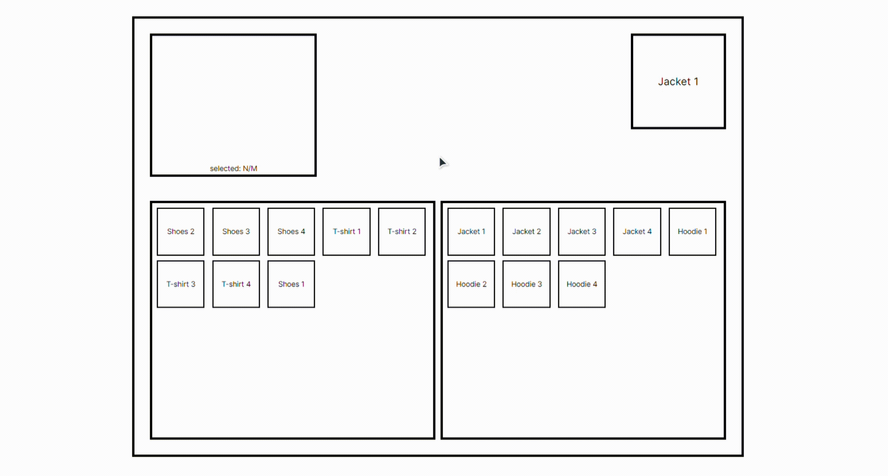

# Simple Cart


</br>
<div align="center">
  
</div>
</br>

## About Simple Cart 📰

Simple Cart is a lightweight and user-friendly implementation of a shopping cart for websites. It provides a left block where users can easily add and remove items from their cart, and a right block specifically designed for adding a single item to the cart. The left block allows users to conveniently manage multiple items in their cart, making it easy to add new items, remove unwanted items, and view the contents of the cart at a glance. The right block provides a simplified interface for quickly adding a single item to the cart with just one click. The project is aimed at offering a seamless and intuitive experience for managing a user's cart on an e-commerce or online shopping website.

### Installation and startup stages
```
npm install
```
```
npm run dev
```

### Additional commands
```
npm run build
```
```
npm run lint
```


### Deployment
This application can be used on Vercel - https://simple-cart-ecru.vercel.app/
